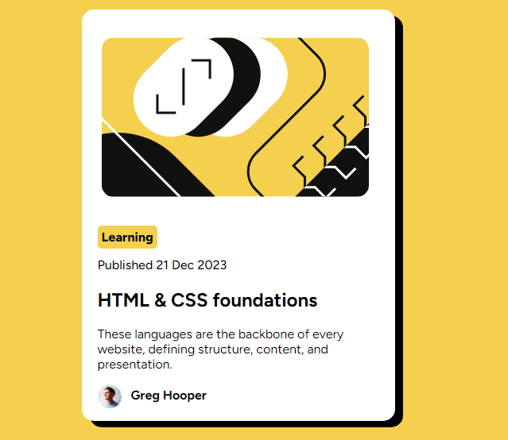

# Frontend Mentor - Blog preview card solution

This is a solution to the [Blog preview card challenge on Frontend Mentor](https://www.frontendmentor.io/challenges/blog-preview-card-ckPaj01IcS). Frontend Mentor challenges help you improve your coding skills by building realistic projects. 

## Table of contents

- [Frontend Mentor - Blog preview card solution](#frontend-mentor---blog-preview-card-solution)
  - [Table of contents](#table-of-contents)
  - [Overview](#overview)
    - [The challenge](#the-challenge)
    - [Screenshot](#screenshot)
    - [Links](#links)
  - [My process](#my-process)
    - [Built with](#built-with)
    - [What I learned](#what-i-learned)
    - [Useful resources](#useful-resources)
  - [Author](#author)

**Note: Delete this note and update the table of contents based on what sections you keep.**

## Overview

### The challenge

Users should be able to:

- See hover and focus states for all interactive elements on the page

### Screenshot

### Links

- Solution URL: [Add solution URL here](https://your-solution-url.com)
- Live Site URL: [Add live site URL here](https://your-live-site-url.com)

## My process

### Built with

- Semantic HTML5 markup
- CSS custom properties
- Flexbox
- Mobile-first workflow

### What I learned

I implemented the knowledge of span in html, here, which is designated for the design of an html element,
I also improved on my knowledge of the use of flex and padding, which kind of gave me some issues.

### Useful resources

- [Example resource 1](https://www.w3schools.com/css/css3_shadows_box.asp) - This helped me with my css box-shadows. 

## Author

- Frontend Mentor - [James](https://www.frontendmentor.io/profile/Jimztech)
- Twitter - [engr_jamie](https://www.twitter.com/engr_jamie)
- Linkedin -[James Ibezim](www.linkedin.com/in/james-chiagozie-ibezim)
